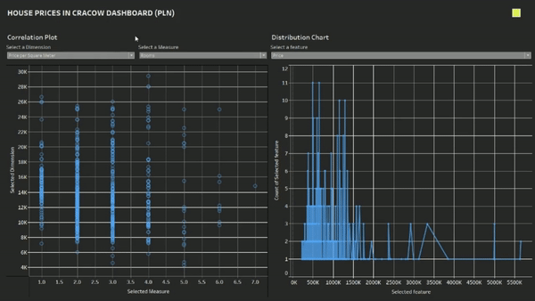
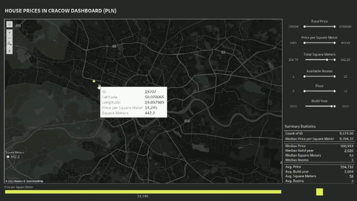

# Cracow Real Estate Market - Tableau Dashboard

The dashboard presents the real estate market in Cracow. The aim of the project is to quickly analyze the market situation, verify the determinants of housing prices and the impact of location. Dashboard prepared in 3 hours block, I will develop this project in the future. 

#### Project Status: [Active]

## Project Objective

### Methods Used
* Data Cleaning
* Data Model Building
* Data Visualization

### Technologies
* Tableau
* Python
* Datalore
* Numpy, Pandas

### Model Building Steps
* defining the questions that the visualization should answer
* data cleaning in Python
* dashboard building in Tableau

## Getting Started

1. Tableau file is being kept in the file Titanic.xls.
2. Data processing scripts are being kept in the file DataCleaning.py.

## Contact
* Please feel free to reach me on my [LinkedIn](http://linkedin.com/in/dominikdawiec/).  

